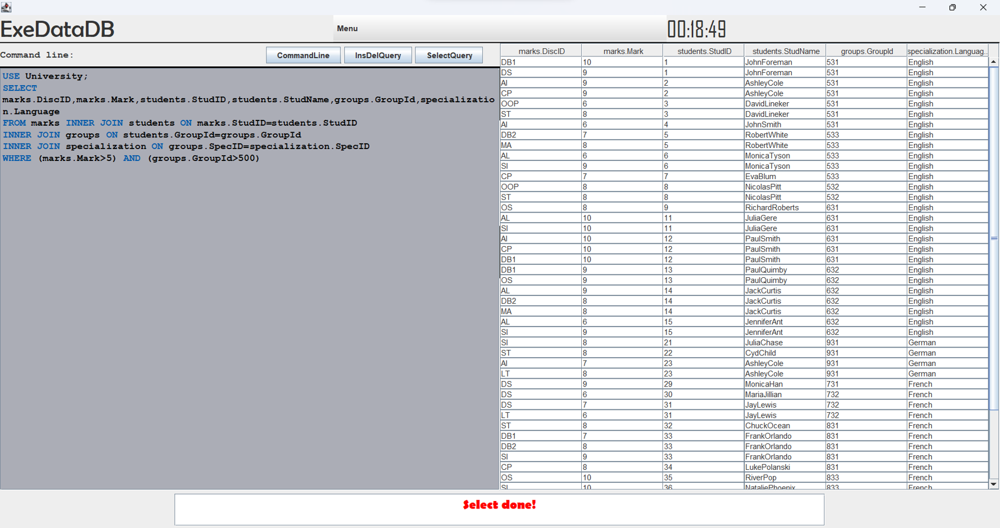
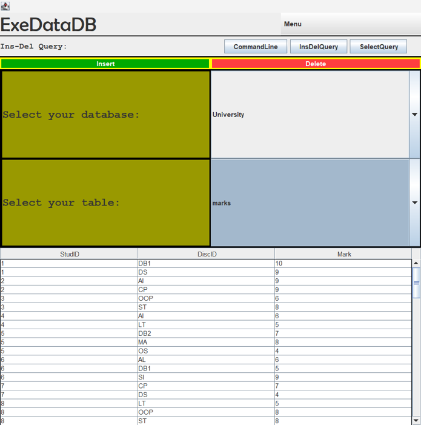
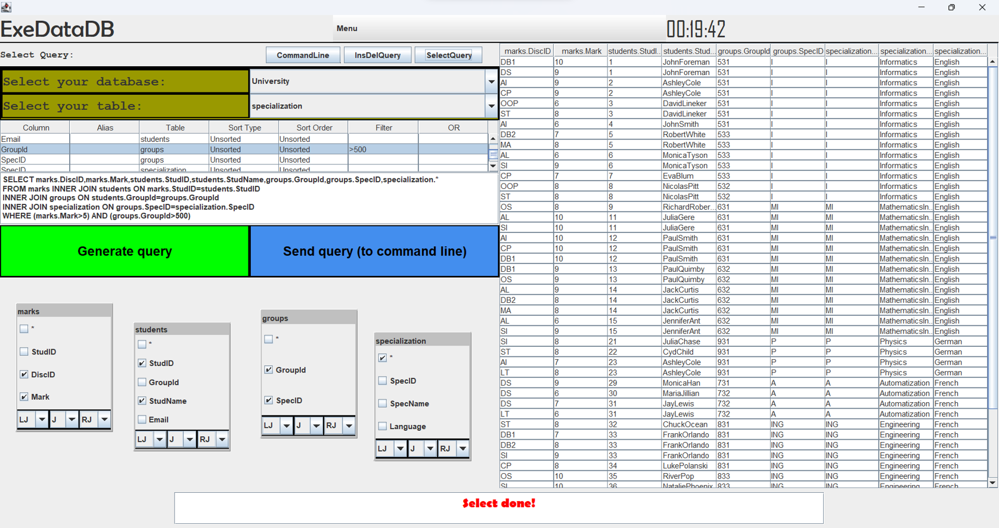

# ExeDataDB documentation
# Backend Overview

The ExeDataDB application is a database management system designed to handle data storage and retrieval efficiently. It provides a backend infrastructure responsible for managing the server-side logic and data operations.

## Backend Structure

The backend of ExeDataDB consists of various packages and classes that work together to handle client requests, execute commands, interact with databases, and ensure the smooth operation of the system. Let's explore the key components of the backend structure:

### SocketServer Package

The `SocketServer` package contains classes related to socket communication and client-server interactions. It facilitates the establishment of connections, receives client requests, and sends responses back to the clients. The primary class in this package is the `Server` class, which runs as a separate thread, listens for incoming client connections, and handles the execution of commands.

### Commands Package

The `Commands` package houses classes responsible for parsing and executing different types of commands received from clients. It includes classes for creating databases, tables, indexes, and performing insertions, deletions, and selections. Each command is encapsulated within a specific class that implements the `Command` interface, allowing for easy extensibility and modular command execution.

### Databases Package

The `Databases` package contains classes and utilities for managing databases, tables, and indexes. It provides functionalities to create, drop, and manipulate database structures, as well as perform operations like insertion, deletion, and selection on tables. The `Databases` class acts as a container for multiple databases, ensuring efficient organization and retrieval of data.

### MongoDBManagement Package

The `MongoDBManagement` package integrates MongoDB as the underlying database system for ExeDataDB. It includes classes for establishing connections, managing databases and collections, and executing MongoDB-specific queries. The `MongoDB` class acts as an interface to interact with the MongoDB server, providing seamless integration and compatibility.

### SaveLoadJSON Package

The `SaveLoadJSON` package offers utilities for saving and loading databases in JSON format. It includes classes for serializing and deserializing databases to and from JSON files. The `LoadJSON` class, in particular, provides a method to load a database from a JSON file, ensuring persistence and data integrity across application sessions.

### Parser Class

The `Parser` class plays a vital role in the backend by parsing client commands, identifying the command type, and executing the appropriate command class. It uses regular expressions to match command patterns and delegates the command execution to the corresponding class. The `Parser` class also handles database selection and error reporting.

## Conclusion

The ExeDataDB backend forms the core of the database management system, responsible for handling client requests, executing commands, managing databases, and ensuring data integrity. It is structured in a modular and extensible manner, allowing for easy addition of new commands and integration with external database systems like MongoDB. With its well-defined components and efficient design, the backend provides a robust foundation for the ExeDataDB application.

# Frontend Overview

The frontend of the application is responsible for providing a user interface through which users can interact with the system. It focuses on displaying information and capturing user input to facilitate seamless communication between the user and the backend.

## Functionalities

### User Input

The frontend offers input fields and buttons for users to enter commands, queries, or data. It captures user input and forwards it to the backend for further processing.

### Displaying Results

The frontend receives data or results from the backend and presents them in a visually organized and readable format. This includes displaying query results in tables, showing error messages, or presenting information in custom views.

### Navigation and Interaction

Users can navigate between different views or panels within the application. This is facilitated through menus, buttons, or tabs, allowing users to access various functionalities effortlessly.

### Validation and Error Handling

The frontend validates user input to ensure it adheres to specified criteria or constraints. It also handles error scenarios by displaying error messages or notifications to guide users in resolving any issues.

### Event Handling

The frontend manages user interactions and events such as button clicks or menu selections. It triggers corresponding actions or functions, facilitating the execution of specific tasks or operations.

## User Interface

The frontend utilizes a range of components, including panels, buttons, text fields, tables, and other graphical elements. These components are arranged in visually appealing layouts to enhance usability and provide an intuitive user experience.

## Conclusion

In summary, the frontend serves as the intermediary between users and the backend, offering an interface that enables users to interact with the system. It encompasses functionalities such as user input, result display, navigation, validation, error handling, and event management. With a well-designed user interface, the frontend enhances user engagement and facilitates effective communication with the underlying system.

# Images

## Command line

## Insert - Delete Query

## Select Query Designer

